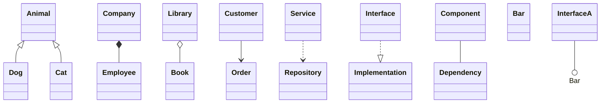

# Class Relations Example

```mermaid
classDiagram
    class Animal
    class Dog
    class Cat
    class Company
    class Employee
    class Library
    class Book
    class Customer
    class Order
    class Service
    class Repository
    class Interface
    class Implementation
    class Component
    class Dependency
    class Bar
    class InterfaceA
    
    Animal <|-- Dog
    Animal <|-- Cat
    Company *-- Employee
    Library o-- Book
    Customer --> Order
    Service ..> Repository
    Interface ..|> Implementation
    Component -- Dependency
    InterfaceA --() Bar
```
