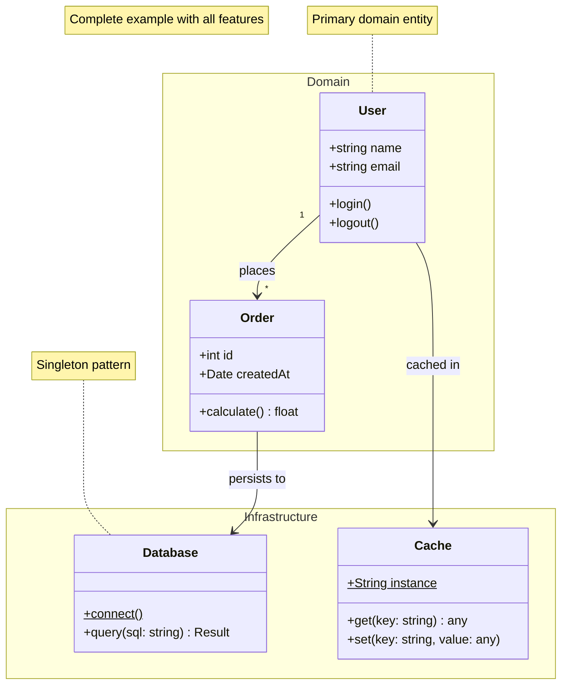

# Complete Class Diagram Example

```mermaid
classDiagram
    %% Domain namespace
    namespace Domain {
        class User {
            +string name
            +string email
            +login()
            +logout()
        }
        
        class Order {
            +int id
            +Date createdAt
            +calculate() float
        }
    }
    
    namespace Infrastructure {
        class Database {
            +connect()$
            +query(sql: string) Result
        }
        
        class Cache {
            +String instance$
            +get(key: string) any
            +set(key: string, value: any)
        }
    }
    
    %% Relations
    User "1" --> "*" Order : places
    Order --> Database : persists to
    User --> Cache : cached in
    
    %% Notes
    note "Complete example with all features"
    note for User "Primary domain entity"
    note for Database "Singleton pattern"
```
