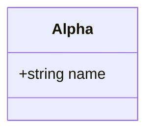
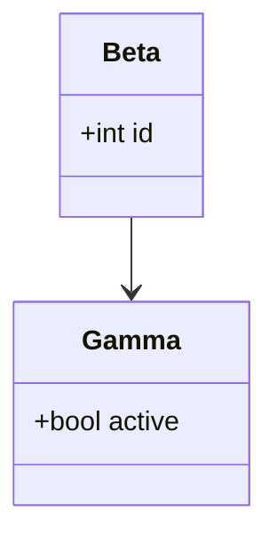
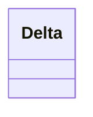

# Multiple Diagrams

First diagram:

```mermaid
classDiagram
    class Alpha {
        +string name
    }
```

Some text between diagrams.

Second diagram:

```mermaid
classDiagram
    class Beta {
        +int id
    }
    class Gamma {
        +bool active
    }
    Beta --> Gamma
```

Third diagram:

```mermaid
classDiagram
    class Delta
```
