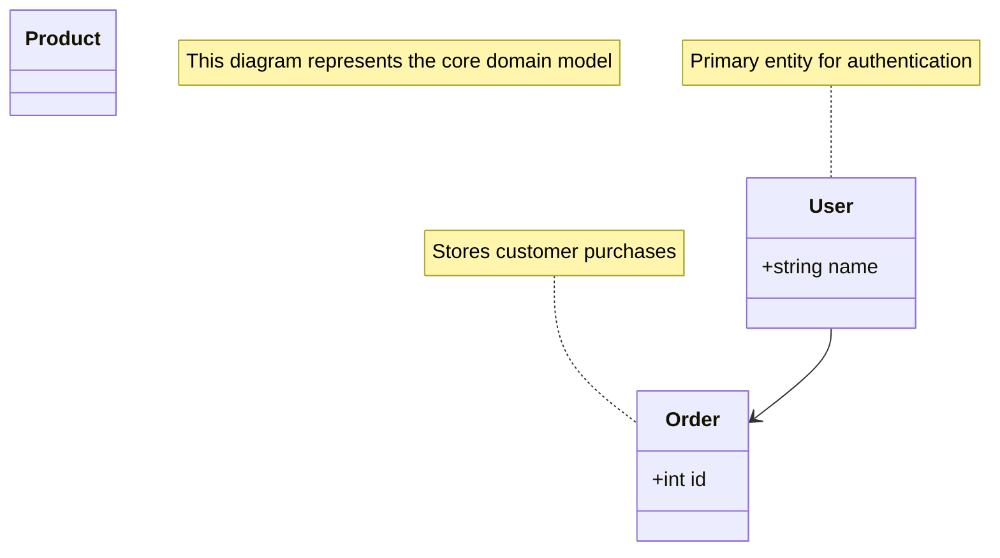

# Notes Example

```mermaid
classDiagram
    class User {
        +string name
    }
    
    class Order {
        +int id
    }
    
    class Product
    
    note "This diagram represents the core domain model"
    note for User "Primary entity for authentication"
    note for Order "Stores customer purchases"
    
    User --> Order
```
