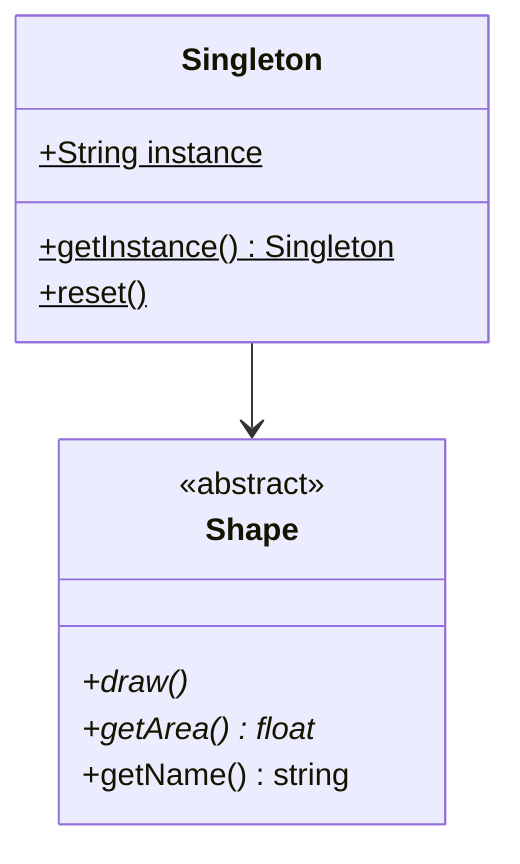

# Static and Abstract Members

```mermaid
classDiagram
    class Singleton {
        +String instance$
        +getInstance() Singleton$
        +reset()$
    }
    
    class Shape {
        <<abstract>>
        +draw()*
        +getArea() float*
        +getName() string
    }
    
    Singleton --> Shape
```
