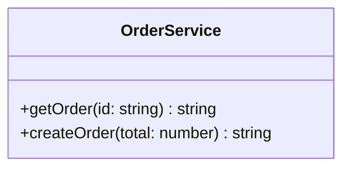

# Phase 2 Services

```mermaid
classDiagram
    class OrderService {
        %% @address app.services
        %% @type definition
        +getOrder(id: string) string
        +createOrder(total: number) string
    }
```
