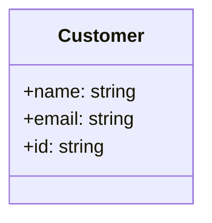
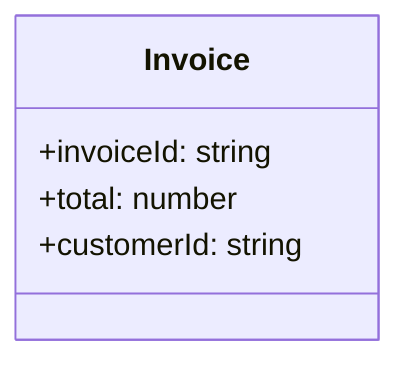

# Domain Models

```mermaid
classDiagram
    class Customer {
        %% @address app.models
        %% @type definition
        +name: string
        +email: string
        +id: string
    }
```

```mermaid
classDiagram
    class Invoice {
        %% @address app.models
        %% @type definition
        +invoiceId: string
        +total: number
        +customerId: string
    }
```
