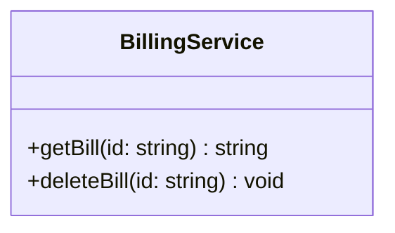
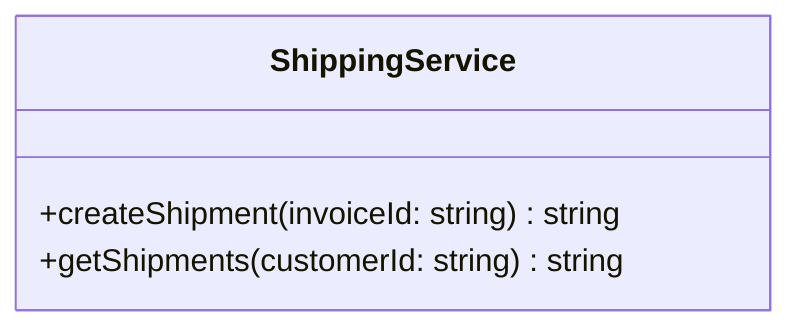

# Services

```mermaid
classDiagram
    class BillingService {
        %% @address app.services
        %% @type definition
        +getBill(id: string) string
        +deleteBill(id: string) void
    }
```

```mermaid
classDiagram
    class ShippingService {
        %% @address app.services
        %% @type definition
        +createShipment(invoiceId: string) string
        +getShipments(customerId: string) string
    }
```
