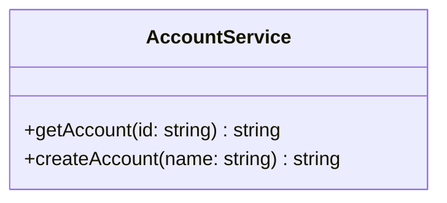
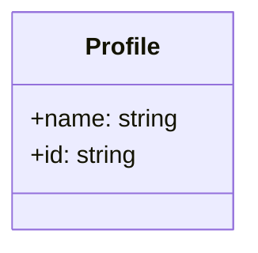

# Account Service

```mermaid
classDiagram
    class AccountService {
        %% @address app.services
        %% @type definition
        +getAccount(id: string) string
        +createAccount(name: string) string
    }
```

```mermaid
classDiagram
    class Profile {
        %% @address app.models
        %% @type definition
        +name: string
        +id: string
    }
```
