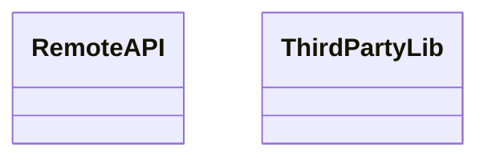

# External References Only

```mermaid
classDiagram
    class RemoteAPI {
        %% @address app.external
        %% @type reference
    }
    class ThirdPartyLib {
        %% @address app.external
        %% @type reference
    }
```
