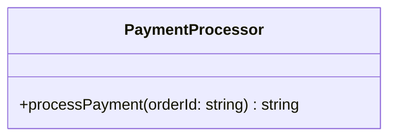
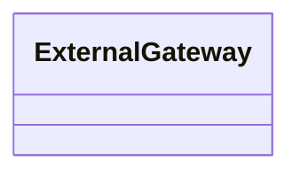

# Broken Reference

```mermaid
classDiagram
    class PaymentProcessor {
        %% @address app.services
        %% @type definition
        +processPayment(orderId: string) string
    }
```

```mermaid
classDiagram
    class ExternalGateway {
        %% @address app.external
        %% @type reference
    }
```
