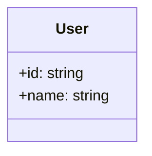
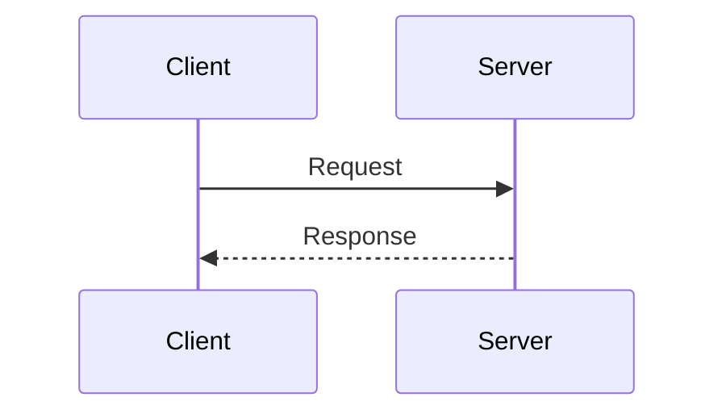

# Simple Spec

A basic spec file with mermaid diagrams.

## Table Data

| Field | Type | Description |
|-------|------|-------------|
| id | string | Unique identifier |
| name | string | User display name |

